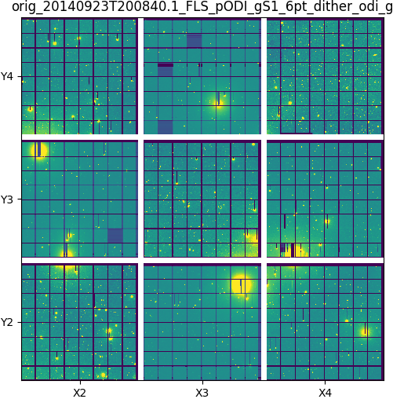
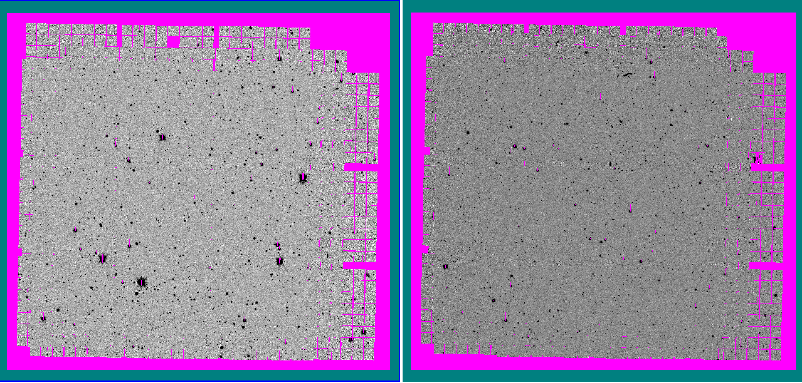

Example
=======

1. Original files
-----------------
In this example, we use PostCalib to reduce the following ODI images:

.. code-block::

    20140923T200840.1_FLS_pODI_gS1_6pt_dither_odi_g.4859.fits.fz
    20140923T200840.2_FLS_pODI_gS1_6pt_dither_odi_g.4859.fits.fz
    20140923T211852.1_FLS_pODI_gS1_6pt_dither_odi_g.4859.fits.fz
    20140923T214636.1_FLS_pODI_gS1_6pt_dither_odi_g.4859.fits.fz
    20140923T222452.1_FLS_pODI_gS1_6pt_dither_odi_g.4859.fits.fz
    20140923T223737.1_FLS_pODI_gS1_6pt_dither_odi_g.4859.fits.fz
    20140925T201215.1_FLS_pODI_gS3_g_6pt_dither_odi_g.4859.fits.fz
    20140925T201215.2_FLS_pODI_gS3_g_6pt_dither_odi_g.4859.fits.fz
    20140925T201215.3_FLS_pODI_gS3_g_6pt_dither_odi_g.4859.fits.fz
    20140925T201215.4_FLS_pODI_gS3_g_6pt_dither_odi_g.4859.fits.fz
    20140925T201215.5_FLS_pODI_gS3_g_6pt_dither_odi_g.4859.fits.fz
    20140925T201215.6_FLS_pODI_gS3_g_6pt_dither_odi_g.4859.fits.fz

These files are operator calibrated images downloaded from the ODI-PPA
website.

2. Setup Work and Job Dirs/Files
--------------------------------

Workdir:

.. code-block:: bash

    # we will use this directory as the work directory
    $ mkdir test_postcalib
    # set up the directory as postcalib workdir. Note that we run
    # outside from the directory so we need to specify the DEST_DIR
    # argument:
    $ postcalib setup test_postcalib
    [INFO] setup: setup workdir tmp/test_postcalib
    [INFO] setup: create extern dir tmp/test_postcalib/extern
    [INFO] setup: check external dependencies
    [INFO] setup: SExtractor ... OK
    [INFO] setup: SCAMP      ... OK
    [INFO] setup: SWarp      ... OK
    [INFO] setup: use shared astromatic prefix /usr/local
    [INFO] setup: stilts     ... OK
    [INFO] setup: use stilts ~/Codes/jars/bin/stilts
    [INFO] setup: funpack    ... OK
    [INFO] setup: use funpack /usr/local/bin/funpack
    [INFO] setup: create log dir tmp/test_postcalib/logs
    [INFO] setup: create tmp dir tmp/test_postcalib/tmp

Jobdir:

.. code-block:: bash

    # setup jobdir. We set the jobkey to be fls201409
    $ cd test_postcalib
    $ postcalib init fls201409 -i ../poditestfls/2014*.fz
    fls201409.init: use config file tmp/test_postcalib/postcalib.yaml
    [INFO] fls201409.init:

    ## config file of PostCalib
    ## Aug-20-2017_13-39-25

    # setting
    phot_model_flags: 'color,ota,cat'

    # qa inputs
    qa_headers: [
        'OBSID', 'CRVAL1', 'CRVAL2', 'OBJECT', 'EXPMEAS', 'AIRMASS',
        'SEEING', 'SKY_MEDI', 'SKY_STD',
        'FILTER', 'INSTRUME', 'MJD-OBS'
        ]

    # naming
    ...

    [INFO] fls201409.init: initialize inputs of job fls201409
    [INFO] fls201409.init: create job inputs dir ~Codes/PostCalib/test_podi/tmp/test_postcalib/fls201409.in
    [INFO] fls201409.init: 20140923T200840.1_FLS_pODI_gS1_6pt_dither_odi_g.4859.fits.fz -> test_postcalib/fls201409.in/orig_20140923T200840.1_FLS_pODI_gS1_6pt_dither_odi_g.fits.fz
    [INFO] fls201409.init: 20140923T200840.2_FLS_pODI_gS1_6pt_dither_odi_g.4859.fits.fz -> test_postcalib/fls201409.in/orig_20140923T200840.2_FLS_pODI_gS1_6pt_dither_odi_g.fits.fz
    ......
    ......
    [INFO] fls201409.init: 20140923T211852.1_FLS_pODI_gS1_6pt_dither_odi_g.4859.fits.fz -> test_postcalib/fls201409.in/orig_20140923T211852.1_FLS_pODI_gS1_6pt_dither_odi_g.fits.fz
    [INFO] fls201409.init: 20140925T201215.5_FLS_pODI_gS3_g_6pt_dither_odi_g.4859.fits.fz -> test_postcalib/fls201409.in/orig_20140925T201215.5_FLS_pODI_gS3_g_6pt_dither_odi_g.fits.fz
    [INFO] fls201409.init: 20140925T201215.6_FLS_pODI_gS3_g_6pt_dither_odi_g.4859.fits.fz -> test_postcalib/fls201409.in/orig_20140925T201215.6_FLS_pODI_gS3_g_6pt_dither_odi_g.fits.fz
    [INFO] fls201409.init: 12 input images linked
    [INFO] qa.preview: create preview for test_postcalib/fls201409.in/orig_20140923T200840.2_FLS_pODI_gS1_6pt_dither_odi_g.fits.fz
    [INFO] qa.preview: instrument podi, number of OTAs 9, preview binning 8
    [INFO] qa.preview: save preview to test_postcalib/fls201409.in/orig_20140925T201215.4_FLS_pODI_gS3_g_6pt_dither_odi_g.png
    ......
    ......
    [INFO] qa.preview: save preview to test_postcalib/fls201409.in/orig_20140925T201215.6_FLS_pODI_gS3_g_6pt_dither_odi_g.png
    [INFO] fls201409.init: summary of input images
    numid fcomb_group fsub_group phot_group mosaic_group mask_otas       OBSI ...
    ----- ----------- ---------- ---------- ------------ --------- ---------- ...
        0           0          0          0            0           20140923T2 ...
        1           0          0          0            0           20140923T2 ...
        2           0          0          0            0           20140923T2 ...
        3           0          0          0            0           20140923T2 ...
        4           0          0          0            0           20140923T2 ...
        5           0          0          0            0           20140923T2 ...
        6           0          0          0            1           20140925T2 ...
        7           0          0          0            1           20140925T2 ...
        8           0          0          0            1           20140925T2 ...
        9           0          0          0            1           20140925T2 ...
       10           0          0          0            1           20140925T2 ...
       11           0          0          0            1           20140925T2 ...
    [INFO] fls201409.init: create sky mask dir test_postcalib/fls201409.skymask

    #  continue of the table ...
    ...D          CRVAL1          CRVAL2                      OBJECT       ...
    ...00840.1   257.739522314   59.1244256272     FLS_pODI_gS1_6pt_dither ...
    ...00840.2   257.774358575   59.1378365967     FLS_pODI_gS1_6pt_dither ...
    ...11852.1   257.763783293   59.1869433177     FLS_pODI_gS1_6pt_dither ...
    ...14636.1   257.736575793   59.1742863639     FLS_pODI_gS1_6pt_dither ...
    ...22452.1   257.666029032   59.1558513834     FLS_pODI_gS1_6pt_dither ...
    ...23737.1   257.578560555    59.124771772     FLS_pODI_gS1_6pt_dither ...
    ...01215.1   259.280018592   59.1304695745   FLS_pODI_gS3_g_6pt_dither ...
    ...01215.2    259.31479092   59.1438801105   FLS_pODI_gS3_g_6pt_dither ...
    ...01215.3   259.296364112   59.1898340054   FLS_pODI_gS3_g_6pt_dither ...
    ...01215.4    259.26931337   59.1774808405   FLS_pODI_gS3_g_6pt_dither ...
    ...01215.5   259.199042828   59.1581787006   FLS_pODI_gS3_g_6pt_dither ...
    ...01215.6   259.112011692   59.1269023084   FLS_pODI_gS3_g_6pt_dither ...

As shown, by default, all the images are set to be of group id = 0 for `fcomb`,
`fsub`, and `phot` groups, and for the `mosaic_group`, there are two
groups 0 and 1, corresponding to the two pointings (OBJECT keyword).

Also created are the preview file for each image, as an example:

   **The preview of the original images**

3. Run the pipeline
-------------------

Before we run the pipeline, we would like to configure how the pipeline is
run. For our case, upon examine the preview images, we do not see
OTAs that need to be masked, or images to be included, so we do not need
to modify the `mask_otas` column. However, we realize that the images
also do not have visible pupil ghost or fringe. Therefore, we would like
to turn off the fringe combine sub routine. To do so, we change all the
values of the `fcomb_group` and `fsub_group` columns to -1.

Now we are ready to run the pipeline:

.. code-block:: bash

    $ postcalib run fls201409.txt

Here are the final mosaics that we created:

   **The final mosaic, left is gS1 (mosaic_group=0), right is gS3 (mosaic_group=1)**

Enjoy!
